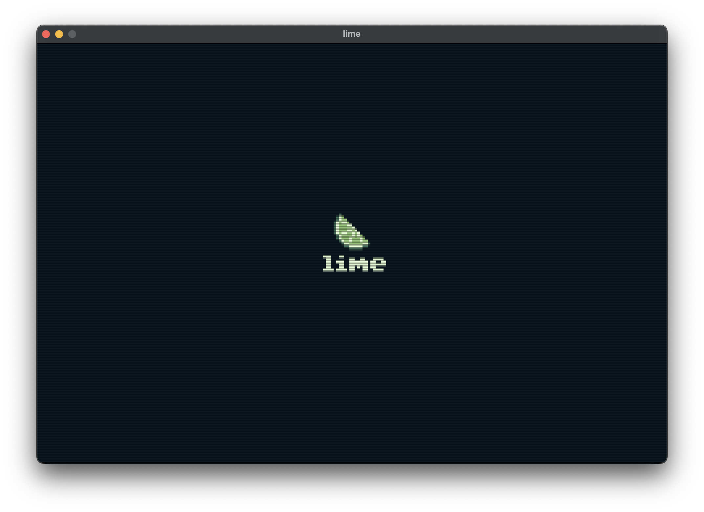
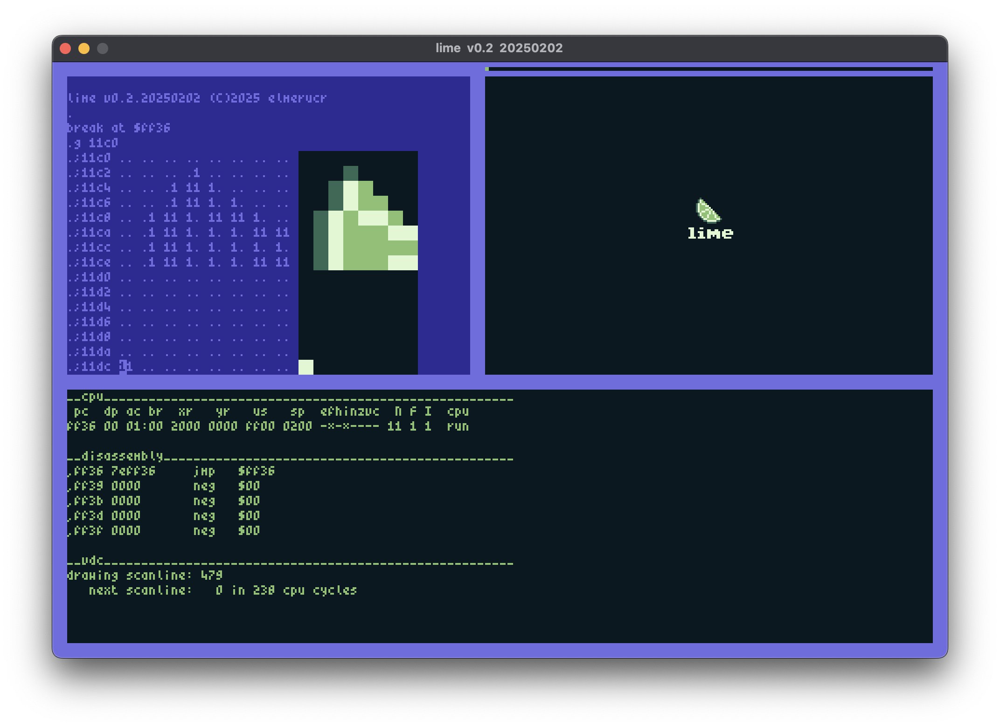

# lime


Lime is a virtual computer system that draws inspiration from computing platforms such as the Commodore 64 and the Nintendo Gameboy. Notable features include:

* MC6809 CPU using the [MC6809](https://github.com/elmerucr/MC6809) library
* 64k RAM
* Screen resolution of 240x160 pixels, refresh rate of 60Hz
* VDC for graphics processing
* Programmable using MC6809 assembly

## Screenshots

### Startup screen



### Debug screen



## Memory Map

### Address space

*work in progress*

## Building

### Preparing Environment

#### MacOS

* Install Xcode from App Store
* When it asks to install command line tools, do that
* Install Homebrew
* From the Homebrew command line, install cmake and SDL2 libraries

#### Ubuntu / Debian

* build-essential, cmake and sdl2-dev

#### Windows specific

* Install msys2
* Install packages:

```
pacman -S mingw-w64-ucrt-x86_64-gcc
pacman -S mingw-w64-ucrt-x86_64-SDL2
...?
...?
```

### Building with CMake

Clone the repository with:
```
git clone https://github.com/elmerucr/lime
cd lime
```

Create a build directory in the source tree
```
mkdir build
cd build
cmake ..
make
```
Alternatively to build with debug symbols:
```
mkdir Debug
cd Debug
cmake -DCMAKE_BUILD_TYPE=Debug ..
make
```
Run with:
```
./lime
```

## Websites and Projects of Interest

### Assemblers and Compilers

* [asm6809](https://www.6809.org.uk/asm6809/) - A portable cross assembler targeting the Motorola 6809 and Hitachi 6309 by Ciaran Anscomb.
* [CMOC](https://freshcode.club/projects/cmoc) - CMOC is a 6809-generating cross-compiler for a large subset of the C language by sarrazip.
* [LWTOOLS](http://www.lwtools.ca) - LWTOOLS is a set of cross-development tools for the Motorola 6809 and Hitachi 6309 microprocessors by Willam 'Lost Wizard' Astle.
* [vasm](http://sun.hasenbraten.de/vasm/) - A portable and retargetable assembler by Volker Barthelmann.
* [vbcc](http://www.compilers.de/vbcc.html) - vbcc is a highly optimizing portable and retargetable ISO C compiler by Volker Barthelmann.
* [vlink](http://www.compilers.de/vlink.html) - A versatile linker by Frank Wille.

### Emulators and Fantasy Consoles

* [Commander X16](https://www.commanderx16.com) - The Commander X16 is a modern 8-bit computer currently in active development. It is the brainchild of David "the 8 Bit Guy" Murray.
* [Commander X16 emulator](https://github.com/x16community/x16-emulator) - Software version of Commander X16.
* [Commander X16 rom](https://github.com/X16Community/x16-rom) - The Commander X16 ROM containing BASIC, KERNAL, and DOS. BASIC and KERNAL are derived from the Commodore 64 versions.
* [Hatari](https://hatari.tuxfamily.org) - Hatari is an Atari ST/STE/TT/Falcon emulator.
* [lib65ce02](https://github.com/elmerucr/lib65ce02) - CSG65CE02 cpu emulator written in C by elmerucr.
* [MC6809](https://github.com/elmerucr/mC6809) - MC6809 cpu emulator written in C++ by elmerucr.
* [Moira](https://github.com/dirkwhoffmann/Moira) - Motorola 68000 cpu emulator written in C++ by Dirk W. Hoffmann.
* [Peddle](https://dirkwhoffmann.github.io/Peddle/) - Peddle is a MOS Technology 6502, 6507, and 6510 emulator with high emulation accuracy by Dirk W. Hoffmann.
* [PICO-8](https://www.lexaloffle.com/pico-8.php) - PICO-8 is a fantasy console for making, sharing and playing tiny games and other computer programs by lexaloffle.
* [reSID](http://www.zimmers.net/anonftp/pub/cbm/crossplatform/emulators/resid/index.html) - ReSID is a Commodore 6581 and 8580 Sound Interface Device emulator by Dag Lem.
* [TIC-80](https://tic80.com) - TIC-80 is a free and open source fantasy computer for making, playing and sharing tiny games.
* [vAmiga](https://dirkwhoffmann.github.io/vAmiga/) - An Amiga 500, 1000, or 2000 on your Apple Macintosh by Dirk W. Hoffmann.
* [VICE](http://vice-emu.sourceforge.net) - The Versatile Commodore Emulator.
* [VirtualC64](https://dirkwhoffmann.github.io/virtualc64/) - A Commodore 64 on your Apple Macintosh by Dirk W. Hoffmann.

### Other

* [freeverb](https://github.com/sinshu/freeverb/) - Free, studio-quality reverb SOURCE CODE in the public domain
* [SDL Simple DirectMedia Layer](https://www.libsdl.org) - A cross-platform development library by Sam Lantinga designed to provide low level access to audio, keyboard, mouse, joystick, and graphics hardware.
* [stb](https://github.com/nothings/stb) - single-file public domain (or MIT licensed) libraries for C/C++

* [visual6502](http://www.visual6502.org) - Visual Transistor-level Simulation of the 6502 CPU and other chips.

## References

Leventhal, Lance A. 1981. 6809 ASSEMBLY LANGUAGE PROGRAMMING. OSBORNE/McGraw-Hill.

Motorola. 1981. MC6809-MC6809E 8-BIT Microprocessor Programming Manual. Motorola Inc.

Motorola Semiconductors. 1983. MC6809 Datasheet.

Osborne, Adam. 1976. An introduction to microcomputers - Volume I Basic Concepts. SYBEX.

Zaks, Rodnay and William Labiak. 1982. Programming the 6809. SYBEX.

## MIT License

Copyright (c) 2025 elmerucr

Permission is hereby granted, free of charge, to any person obtaining a copy of this software and associated documentation files (the "Software"), to deal in the Software without restriction, including without limitation the rights to use, copy, modify, merge, publish, distribute, sublicense, and/or sell copies of the Software, and to permit persons to whom the Software is furnished to do so, subject to the following conditions:

The above copyright notice and this permission notice shall be included in all copies or substantial portions of the Software.

THE SOFTWARE IS PROVIDED "AS IS", WITHOUT WARRANTY OF ANY KIND, EXPRESS OR IMPLIED, INCLUDING BUT NOT LIMITED TO THE WARRANTIES OF MERCHANTABILITY, FITNESS FOR A PARTICULAR PURPOSE AND NONINFRINGEMENT. IN NO EVENT SHALL THE AUTHORS OR COPYRIGHT HOLDERS BE LIABLE FOR ANY CLAIM, DAMAGES OR OTHER LIABILITY, WHETHER IN AN ACTION OF CONTRACT, TORT OR OTHERWISE, ARISING FROM, OUT OF OR IN CONNECTION WITH THE SOFTWARE OR THE USE OR OTHER DEALINGS IN THE
SOFTWARE.
