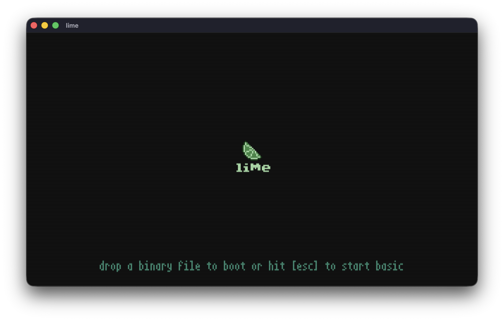
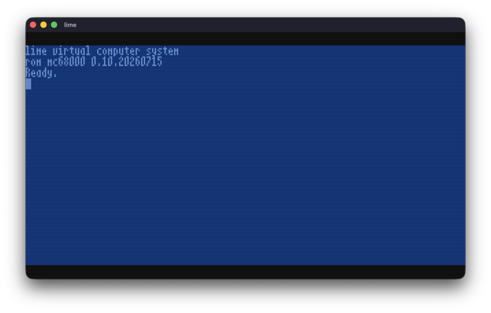
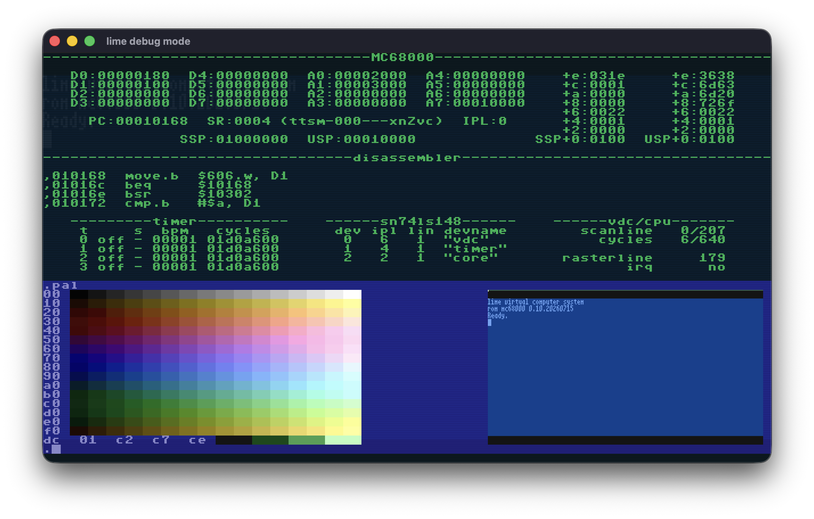

# lime


Lime is a virtual computer system that draws inspiration from computing platforms such as the Commodore 64 (look and feel, VIC-II, SID), the Amiga 500 and Atari ST (Motorola 68000), the original Nintendo Gameboy (tiles system) and the Atari 800xl (GTIA color palette).

Notable features include:

* Motorola MC68000 cpu using the [Moira](https://github.com/dirkwhoffmann/Moira) library
* 16mb ram
* Screen resolution of 320x180 pixels, refresh rate of 60Hz
* Video Display Controller (VDC) for graphics processing, shared memory access to lowest 64k
* Programmable using Motorola 68000 assembly (see ```examples``` folder)

By default, lime starts in MC68000 mode.

## Screenshots







## Binaries (apps / games)

Binaries (in ```decb``` format and borrowed from the TRS-80 Color Computer / Disk Extended Color Basic specification) can be dragged and dropped onto the application.

The original specification is largely followed (information can be found on the webpage for [LWTOOLS](https://www.lwtools.ca/manual/x27.html)). Binaries include the load address of the binary as well as encoding an execution address. These binaries may contain multiple loadable sections, each of which has its own load address.

Each binary starts with a preamble. Each preamble is nine bytes long and starts with the magic byte ```$01```, the next four bytes (big endian) specify the number of bytes to load (first byte must be ```$00```), the next four bytes (big endian, first byte ```$00```) the address to load at. There may be multiple preambles / chunks to load.

The postamble (nine bytes) starts with magic byte ```$fe```, the next four are zero, then four bytes follow (big endian, first ```$00```) the execution address for the binary.

## Memory Map

```
0x000000 - 0x000007 initial ssp / reset vector (8b)
0x000008 - 0x0003ff mc68000 vector table (1016b)
0x000400 - 0x00047f io vdc (128b)
0x000480 - 0x0004bf io core (64b)
0x0004c0 - 0x0004ff io timer (64b)
0x000500 - 0x00051f io sound / sid0 (32b)
0x000520 - 0x00053f io sound / sid1 (32b)
0x000540 - 0x00055f io sound / analog0 (32b)
0x000560 - 0x00057f io sound / analog1 (32b)
0x000580 - 0x0005ff io sound / mixer (128b)
0x000600 - 0x0006ff io keyboard (256b)
0x000700 - 0x0007ff unused / reserved (256b)
0x000800 - 0x000fff default location tileset & 4x8 tileset in rom (2kb)
0x001000 - 0x001fff default location tileset & 8x8 tileset in rom (4kb)
0x002000 - 0x002fff default layer tiles (4kb)
0x003000 - 0x003fff default layer colors (4kb)
0x004000 - 0x00ffff available ram (48kb)
0x010000 - 0x01ffff system rom (64kb)
0x020000 - 0xffffff available ram (16256kb)
```

## Building with CMake

Clone the repository with:
```shell
git clone https://github.com/elmerucr/lime
cd lime
```

Create a build directory in the source tree
```shell
mkdir Release
cd Release
cmake ..
make
```
Alternatively to build with debug symbols:
```shell
mkdir Debug
cd Debug
cmake -DCMAKE_BUILD_TYPE=Debug ..
make
```
Run with:
```shell
./lime
```

## Websites and Projects of Interest

### Assemblers and Compilers

* [asmx](http://xi6.com/projects/asmx/) - A multi-CPU macro assembler by Bruce Tomlin for many major 8-bit and 16-bit CPUs, which can assemble code for multiple CPUs in the same source file.
* [EASy68K-asm](https://github.com/rayarachelian/EASy68K-asm) - CLI 68000 assembler from the EASy68k project.
* [vasm](http://sun.hasenbraten.de/vasm/) - A portable and retargetable assembler by Volker Barthelmann.
* [vbcc](http://www.compilers.de/vbcc.html) - vbcc is a highly optimizing portable and retargetable ISO C compiler by Volker Barthelmann.
* [vlink](http://www.compilers.de/vlink.html) - A versatile linker by Frank Wille.

### Emulators

* [Commander X16](https://www.commanderx16.com) - The Commander X16 is a modern 8-bit computer currently in active development. It is the brainchild of David "the 8 Bit Guy" Murray.
* [Commander X16 emulator](https://github.com/x16community/x16-emulator) - Software version of Commander X16.
* [Commander X16 rom](https://github.com/X16Community/x16-rom) - The Commander X16 ROM containing BASIC, KERNAL, and DOS. BASIC and KERNAL are derived from the Commodore 64 versions.
* [Hatari](https://hatari.tuxfamily.org) - Hatari is an Atari ST/STE/TT/Falcon emulator.
* [lib65ce02](https://github.com/elmerucr/lib65ce02) - CSG65CE02 cpu emulator written in C by elmerucr.
* [mc6809](https://github.com/elmerucr/mc6809) -  Motorola 6809 cpu emulator written in C++ by elmerucr.
* [Moira](https://github.com/dirkwhoffmann/Moira) - Motorola 68000 cpu emulator written in C++ by Dirk W. Hoffmann.
* [Peddle](https://dirkwhoffmann.github.io/Peddle/) - Peddle is a MOS Technology 6502, 6507, and 6510 emulator with high emulation accuracy by Dirk W. Hoffmann.
* [reSID](http://www.zimmers.net/anonftp/pub/cbm/crossplatform/emulators/resid/index.html) - ReSID is a Commodore 6581 and 8580 Sound Interface Device emulator by Dag Lem.
* [vAmiga](https://dirkwhoffmann.github.io/vAmiga/) - An Amiga 500, 1000, or 2000 on your Apple Macintosh by Dirk W. Hoffmann.
* [VICE](http://vice-emu.sourceforge.net) - The Versatile Commodore Emulator.
* [VirtualC64](https://dirkwhoffmann.github.io/virtualc64/) - A Commodore 64 on your Apple Macintosh by Dirk W. Hoffmann.
* [vrEmu6502](https://github.com/visrealm/vrEmu6502) - 6502/65C02 emulator library (C99)
* [z80](https://github.com/superzazu/z80) - A z80 emulator written in C99 by Nicolas Allemand.

### Other

* [PICO-8](https://www.lexaloffle.com/pico-8.php) - PICO-8 is a fantasy console for making, sharing and playing tiny games and other computer programs by lexaloffle.
* [SDL Simple DirectMedia Layer](https://www.libsdl.org) - A cross-platform development library by Sam Lantinga designed to provide low level access to audio, keyboard, mouse, joystick, and graphics hardware.
* [stb](https://github.com/nothings/stb) - single-file public domain (or MIT licensed) libraries for C/C++
* [TIC-80](https://tic80.com) - TIC-80 is a free and open source fantasy computer for making, playing and sharing tiny games.
* [visual6502](http://www.visual6502.org) - Visual Transistor-level Simulation of the 6502 CPU and other chips.

## References

Clements, Alan. 1994. 68000 Family Assembly Language. PWS Publishing Company.

Leventhal, Hawkins, Kane and Cramer. 1986. 68000 ASSEMBLY LANGUAGE PROGRAMMING SECOND EDITION. OSBORNE/McGraw-Hill.

Osborne, Adam. 1976. An introduction to microcomputers - Volume I Basic Concepts. SYBEX.

Skinner, Thomas P. Assembly Language Programming for the 68000 Family. John Wiley & Sons.

## MIT License

Copyright (c) 2026 elmerucr

Permission is hereby granted, free of charge, to any person obtaining a copy of this software and associated documentation files (the "Software"), to deal in the Software without restriction, including without limitation the rights to use, copy, modify, merge, publish, distribute, sublicense, and/or sell copies of the Software, and to permit persons to whom the Software is furnished to do so, subject to the following conditions:

The above copyright notice and this permission notice shall be included in all copies or substantial portions of the Software.

THE SOFTWARE IS PROVIDED "AS IS", WITHOUT WARRANTY OF ANY KIND, EXPRESS OR IMPLIED, INCLUDING BUT NOT LIMITED TO THE WARRANTIES OF MERCHANTABILITY, FITNESS FOR A PARTICULAR PURPOSE AND NONINFRINGEMENT. IN NO EVENT SHALL THE AUTHORS OR COPYRIGHT HOLDERS BE LIABLE FOR ANY CLAIM, DAMAGES OR OTHER LIABILITY, WHETHER IN AN ACTION OF CONTRACT, TORT OR OTHERWISE, ARISING FROM, OUT OF OR IN CONNECTION WITH THE SOFTWARE OR THE USE OR OTHER DEALINGS IN THE
SOFTWARE.
