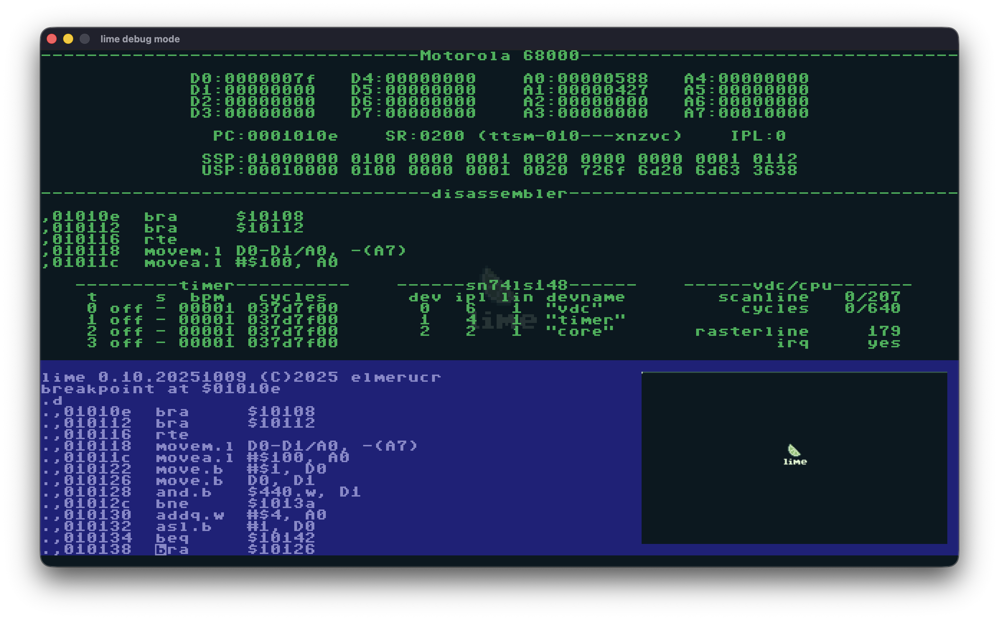

# lime


Lime is a virtual computer system that draws inspiration from computing platforms such as the Commodore 64, the Atari ST and the Nintendo Gameboy. Notable features include:

* Motorola 6809 cpu using the [mc6809](https://github.com/elmerucr/mc6809) library
* Motorola 68000 cpu using the [Moira](https://github.com/dirkwhoffmann/Moira) library
* 16mb ram (of which the lowest 64k accessible by mc6809)
* Screen resolution of 320x180 pixels, refresh rate of 60Hz
* Video Display Controller (VDC) for graphics processing, memory access to lowest 64k
* Programmable using mc68000 or mc6809 assembly

By default, the system starts in mc68000 mode.

## Screenshots




## Binaries

Binaries (in ```decb``` format and borrowed from TRS-80 Color Computer / Disk Extended Color Basic) can be dragged and dropped onto the application.

### In mc6809 mode

This follows the original specification. Information can be found on the webpage for [LWTOOLS](https://www.lwtools.ca/manual/x27.html).

Binaries include the load address of the binary as well as encoding an execution address. These binaries may contain multiple loadable sections, each of which has its own load address.

Each binary starts with a preamble. Each preamble is five bytes long. The first byte is ```$00```. The next two bytes specify the number of bytes to load and the last two bytes specify the address to load at. Then, a string of bytes follows. After this string of bytes, there may be another preamble or postamble. A postamble is also five bytes in length. The first byte of the postamble is ```$ff```, the next two are zero, and the last two are the execution address for the binary.

### In mc68000 mode

to be done

## Memory Map

### Motorola 6809 mode

to be done

### Motorola 68000 mode

```
0x000000 - 0x000007 initial ssp / reset vector (8b)
0x000008 - 0x0003ff vector table (1016b)
0x000400 - 0x00043f io vdc (64b)
0x000440 - 0x00047f io timer (64b)
0x000480 - 0x0004bf io core (64b)
0x0004c0 - 0x0004ff unused / reserved (64b)
0x000500 - 0x00051f io sound / sid0 (32b)
0x000520 - 0x00053f io sound / sid1 (32b)
0x000540 - 0x00055f io sound / analog0 (32b)
0x000560 - 0x00057f io sound / analog1 (32b)
0x000580 - 0x0005ff io sound / mixer (128b)
0x000600 - 0x0007ff unused / reserved (512b)
0x000800 - 0x000fff available ram (2kb)
0x001000 - 0x001fff default location tileset & tileset in rom (4kb)
0x002000 - 0x0027ff layer 0 colors (2kb)
0x002800 - 0x002fff layer 1 colors (2kb)
0x003000 - 0x0037ff layer 2 colors (2kb)
0x003800 - 0x003fff layer 3 colors (2kb)
0x004000 - 0x0047ff layer 0 tiles (2kb)
0x004800 - 0x004fff layer 1 tiles (2kb)
0x005000 - 0x0057ff layer 2 tiles (2kb)
0x005800 - 0x005fff layer 3 tiles (2kb)
0x006000 - 0x00ffff available ram (40kb)
0x010000 - 0x01ffff system rom (64kb)
0x020000 - 0xffffff available ram (16256kb)
```

## Building with CMake

Clone the repository with:
```shell
git clone https://github.com/elmerucr/lime
cd lime
```

Create a build directory in the source tree
```shell
mkdir build
cd build
cmake ..
make
```
Alternatively to build with debug symbols:
```shell
mkdir Debug
cd Debug
cmake -DCMAKE_BUILD_TYPE=Debug ..
make
```
Run with:
```shell
./lime
```

## Websites and Projects of Interest

### Assemblers and Compilers

* [asm6809](https://www.6809.org.uk/asm6809/) - A portable cross assembler targeting the Motorola 6809 and Hitachi 6309 by Ciaran Anscomb.
* [asmx](http://xi6.com/projects/asmx/) - A multi-CPU macro assembler by Bruce Tomlin for many major 8-bit and 16-bit CPUs, which can assemble code for multiple CPUs in the same source file.
* [CMOC](https://freshcode.club/projects/cmoc) - CMOC is a 6809-generating cross-compiler for a large subset of the C language by sarrazip.
* [LWTOOLS](http://www.lwtools.ca) - LWTOOLS is a set of cross-development tools for the Motorola 6809 and Hitachi 6309 microprocessors by Willam 'Lost Wizard' Astle.
* [vasm](http://sun.hasenbraten.de/vasm/) - A portable and retargetable assembler by Volker Barthelmann.
* [vbcc](http://www.compilers.de/vbcc.html) - vbcc is a highly optimizing portable and retargetable ISO C compiler by Volker Barthelmann.
* [vlink](http://www.compilers.de/vlink.html) - A versatile linker by Frank Wille.

### Emulators

* [Commander X16](https://www.commanderx16.com) - The Commander X16 is a modern 8-bit computer currently in active development. It is the brainchild of David "the 8 Bit Guy" Murray.
* [Commander X16 emulator](https://github.com/x16community/x16-emulator) - Software version of Commander X16.
* [Commander X16 rom](https://github.com/X16Community/x16-rom) - The Commander X16 ROM containing BASIC, KERNAL, and DOS. BASIC and KERNAL are derived from the Commodore 64 versions.
* [Hatari](https://hatari.tuxfamily.org) - Hatari is an Atari ST/STE/TT/Falcon emulator.
* [lib65ce02](https://github.com/elmerucr/lib65ce02) - CSG65CE02 cpu emulator written in C by elmerucr.
* [mc6809](https://github.com/elmerucr/mc6809) -  Motorola 6809 cpu emulator written in C++ by elmerucr.
* [Moira](https://github.com/dirkwhoffmann/Moira) - Motorola 68000 cpu emulator written in C++ by Dirk W. Hoffmann.
* [Peddle](https://dirkwhoffmann.github.io/Peddle/) - Peddle is a MOS Technology 6502, 6507, and 6510 emulator with high emulation accuracy by Dirk W. Hoffmann.
* [reSID](http://www.zimmers.net/anonftp/pub/cbm/crossplatform/emulators/resid/index.html) - ReSID is a Commodore 6581 and 8580 Sound Interface Device emulator by Dag Lem.
* [vAmiga](https://dirkwhoffmann.github.io/vAmiga/) - An Amiga 500, 1000, or 2000 on your Apple Macintosh by Dirk W. Hoffmann.
* [VICE](http://vice-emu.sourceforge.net) - The Versatile Commodore Emulator.
* [VirtualC64](https://dirkwhoffmann.github.io/virtualc64/) - A Commodore 64 on your Apple Macintosh by Dirk W. Hoffmann.

### Other

* [PICO-8](https://www.lexaloffle.com/pico-8.php) - PICO-8 is a fantasy console for making, sharing and playing tiny games and other computer programs by lexaloffle.
* [SDL Simple DirectMedia Layer](https://www.libsdl.org) - A cross-platform development library by Sam Lantinga designed to provide low level access to audio, keyboard, mouse, joystick, and graphics hardware.
* [stb](https://github.com/nothings/stb) - single-file public domain (or MIT licensed) libraries for C/C++
* [TIC-80](https://tic80.com) - TIC-80 is a free and open source fantasy computer for making, playing and sharing tiny games.
* [visual6502](http://www.visual6502.org) - Visual Transistor-level Simulation of the 6502 CPU and other chips.

## References

Clements, Alan. 1994. 68000 Family Assembly Language. PWS Publishing Company.

Leventhal, Hawkins, Kane and Cramer. 1986. 68000 ASSEMBLY LANGUAGE PROGRAMMING SECOND EDITION. OSBORNE/McGraw-Hill.

Leventhal, Lance A. 1981. 6809 ASSEMBLY LANGUAGE PROGRAMMING. OSBORNE/McGraw-Hill.

Motorola. 1981. MC6809-MC6809E 8-BIT Microprocessor Programming Manual. Motorola Inc.

Motorola Semiconductors. 1983. MC6809 Datasheet.

Osborne, Adam. 1976. An introduction to microcomputers - Volume I Basic Concepts. SYBEX.

Skinner, Thomas P. Assembly Language Programming for the 68000 Family. John Wiley & Sons.

Zaks, Rodnay and William Labiak. 1982. Programming the 6809. SYBEX.

## MIT License

Copyright (c) 2025 elmerucr

Permission is hereby granted, free of charge, to any person obtaining a copy of this software and associated documentation files (the "Software"), to deal in the Software without restriction, including without limitation the rights to use, copy, modify, merge, publish, distribute, sublicense, and/or sell copies of the Software, and to permit persons to whom the Software is furnished to do so, subject to the following conditions:

The above copyright notice and this permission notice shall be included in all copies or substantial portions of the Software.

THE SOFTWARE IS PROVIDED "AS IS", WITHOUT WARRANTY OF ANY KIND, EXPRESS OR IMPLIED, INCLUDING BUT NOT LIMITED TO THE WARRANTIES OF MERCHANTABILITY, FITNESS FOR A PARTICULAR PURPOSE AND NONINFRINGEMENT. IN NO EVENT SHALL THE AUTHORS OR COPYRIGHT HOLDERS BE LIABLE FOR ANY CLAIM, DAMAGES OR OTHER LIABILITY, WHETHER IN AN ACTION OF CONTRACT, TORT OR OTHERWISE, ARISING FROM, OUT OF OR IN CONNECTION WITH THE SOFTWARE OR THE USE OR OTHER DEALINGS IN THE
SOFTWARE.
